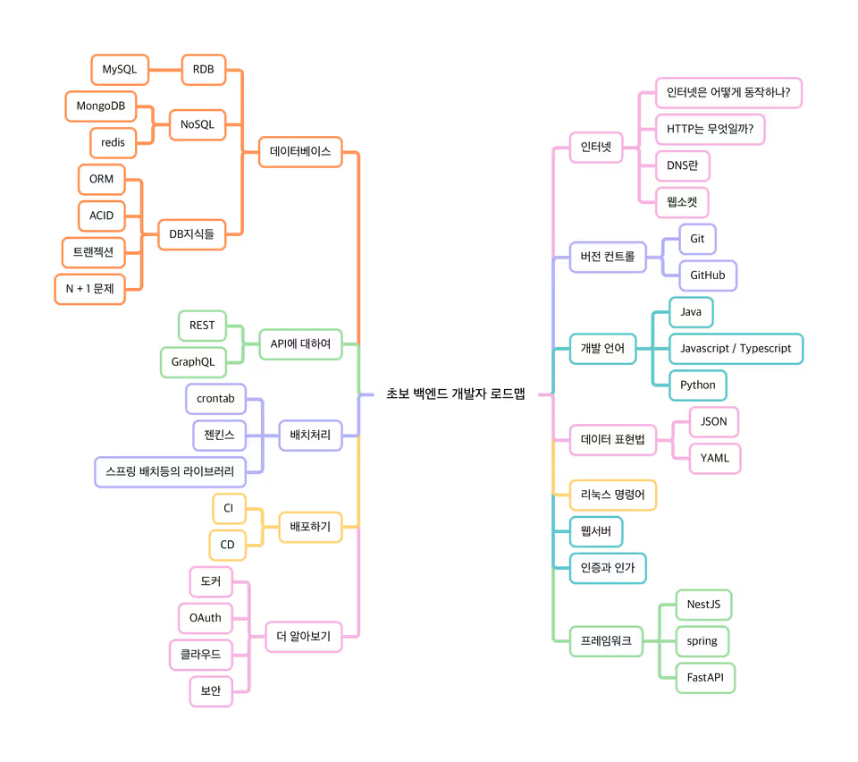

# 1.1 백엔드 개발자가 알아야 하는 지식 로드맵

백엔드 개발을 시작할 때는 개별 기술을 바로 배우기보다, 먼저 전체 흐름을 보는 것이 중요합니다.
아래 이미지는 백엔드 개발자가 알아두면 좋은 핵심 개념을 한눈에 볼 수 있도록 정리한 로드맵입니다.

## 함께 보면 좋은 핵심 키워드

- HTTP / HTTPS
- 클라이언트와 서버
- REST API
- JSON 데이터 구조
- 인증과 인가
- 쿠키 / 세션 / 토큰
- 데이터베이스
- 비동기 처리
- 에러 처리
- 환경 변수와 로그

이후 문서에서는 위 개념들을 하나씩 정리하면서 백엔드 개발의 기초를 차근차근 익혀갈 수 있습니다.

해당 책에서는

- 익스프레스
- NestJS
- 인증 관련
  - 인증, 인간, OAuth
- 프로그래밍 언어
  - 자바스크립트/타입스크립트
- 데이터베이스
  - NoSQL
  - 몽고디비
  - ORM
  - RDB
    - SQLite

- 백엔드 개발자는 클라이언트 프론트엔드 영역의 요청 컴퓨터가 수행하도록 하는 사람이다.
- 주로 리눅스나 서버용 윈도우를 운영체제로 사용하여 서버에 대한 이해가 필요, 서버 운영체제에 대한 학습이 필요하다.
- 명령줄 인터페이스(Command-Line Interface, CLI) 환경에서 서버를 운영하는 것이 유리하다.

프로토콜은 네트워크라는 범주의 일부다.

- HTTP, TCP/UDP, 라우팅, NAT, OSI 7 계층 등이 있다. 별도의 책으로 공부해야 한다.
- HTTP 프로토콜을 알아둬야한다.
- DNS도 알아둬야 한다. IP는 인터넷에서 주소 역할을 한다. IP는 32비트로 이루어진 IPv4와 128비트로 이루어진 IPv6가 있다.
- 사람이 외우기 편한 언어로 된 주소 -> 도메인, 해당 도메인 주소를 IP 주소로 변경하는 것이 DNS이다.

백엔드에서는 파일이나 이미지 같은 정적인 파일을 서비스 하는 서버를 **웹 서버**
데이터를 처리하는 서버를 **WAS**라고 부른다.

|---|설명|대표 제품|
|웹서버|요청된 웹페이지나 정보를 제공하는 서버, 주로 정적인 콘텐츠를 제공하는데 사용된다.|아파치 HTTP Server, Ngnix, IIS|
|WAS|동적인 웹 애플리케이션을 실행하는데 사용되는 서버, 단독으로 사용하기보다 웹 서버 뒤에 요청에 대한 응답을 제공한다 | 아파치 톰캣, 웹스피어, JEUS |

- WAS는 정적 파일을 처리할 수 있으나 Nginx 같은 웹 서버가 훨씬 더 알맞다.
- 개발자는 프레임 워크를 기반으로 요구사항에 필요한 코드를 추가한다는 의미이다.

- 백엔드 프로그래밍 언어로는 -> JavaScript(자바스크립트), TypeScript(타입스크립트), 자바, 코틀린, 파이썬, 고랭, 러스트, C#, C++ 등이 있다.
- 대부분이 Git과 GitHub를 사용한다.

- 서버도 구축하고, 코드도 작성하면 테스트와 배포를 해야한다.
- 테스트는 대부분 테스트 코드로 실행하는 테스트를 말한다.

> 단위테스트(Unit Test)
> 소프트웨어 단위 (함수, 클래스 등) 별로 테스트 코드를 작성해 수행하는 기법, 제 3자가 실행하기보다는 개발자가 코드를 작성하면 같이 수행하는 경우가 많다.

- 배포는 개발하고 테스트가 완료된 코드를 서버에 전달, 실행하는 것을 의미한다ㅣ.
- 컨테이너 환경(Docker)을 이용하여 개발과 실제 운영 서버의 환경을 동일하게 맞춰 테스트 할 수 있다.
- 스크립트를 만들어 배포하거나, 컨테이너 환경의 경우 K8s(Kubernetes)라는 기술을 사용해 배포를 하기도 한다.
