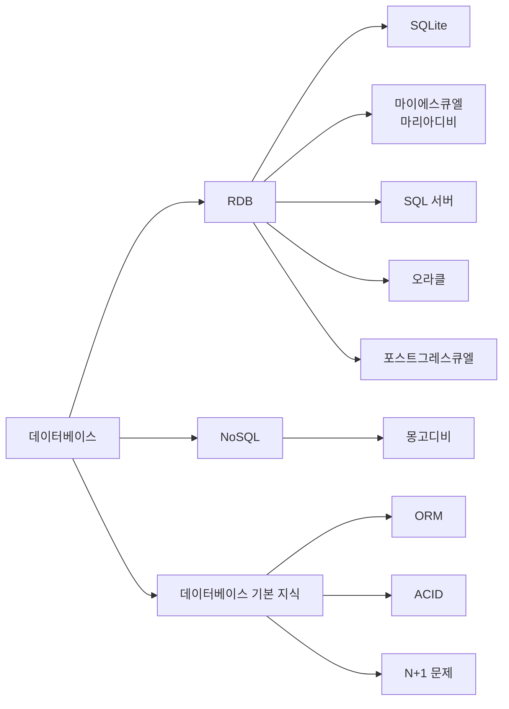

# 1.5 데이터베이스

- 서버는 클라에서 받은 데이터를 어딘가에 저장한다. 다양한 종류의 파일을 저장하는데 검색을 지원하고, 입력한 데이터 수정 및 삭제도 가능, 수많은 읽기와 수정 삭제 요청이 동시다발로 이루어지는 상황이 있을 수 있다.
- 데이터베이스는 즉, 데이터베이스 소프트웨어를 의마한다.
- 데이터베이스는 데이터 저장 시 수많은 문제가 생길수 있는 상황에서 데이터를 가능한 안전하게 보관, 검색, 수정, 삭제가 가능하도록 하는 소프트웨어다.

- 주요 데이터베이스

- 오라클(Oracle), 마이에스큐엘(MySQL), 마리아디비(MariaDB), SQL, 포스트그레스큐엘(PostgresSQL), 에스큐엘라이트, 몽고디비 등이 있다.

---

## 1.5.1 RDB

- 데이터베이스는 RDB와 RDB가 아닌 것으로 보통 구분한다.
- RDB는 Relational Database 약자, 관계형 데이터베이스
- RDB가 아닌 데이터베이스르 NoSQL라고 부른다.

### ACID 트랜잭션

ACID로 불리는 트랜잭션이 있다.
ACID는 각각 원자성(Atomicity), 일관성(Consistency), 격리성(Isolation), 내구성(Durability)을 의미한다.

- 원자성은 트랜잭션을 구성하는 명령어 하나의 묶음으로 처리되어 성공하거나 실패하는 것을 보장하는 기법이다.
- 일관성은 트랜잭션에서 실행된 변경 사항이 데이터베이스의 무결성 조건을 만족한다.
- 격리성은 두 개의 트랜잭션이 서로에게 영향을 미칠 수 없는 성질을 말한다.
- 일관성을 유지하고 문제가 생긴 떄에 이전의 상태로 되돌릴 수 있게 해준다.

### SQL

SQL은 Structured Query Language의 약자 말그대로 쿼리(데이터 검색)을 하는 프로그래밍 언어이다. SQL도 하나만 있는 것이 아닌 각 RDB별로 있다.

## 1.5.2 NoSQL(Not Only SQL)

NoSQL은 SQL을 안 쓴다는 의미이다.
데이터베이스 성능을 높이려면 스케일업 또는 머신을 여러 대로 분리하는 스케일아웃이 필요하다.
스케일 아웃은 데이터베이스가 여러 대가 되면서 분산되어 트랜잭션을 사용하면 성능이 떨어지고 기보적으로 스케일아웃을 지원하지 않는다.

- 이런 문제점들을 해결하기 위해 NoSQL이 등장했다.

키 밸류 캐시, 키 밸류 스토어, 도큐먼트 스토어, 와이드 컬럼 스토어 정도를 사용한다.

- 키 밸류 캐시
  - 멤캐시드와 레디스가 많이 사용된다.
  - 맴캐시드는 키 밸류 형태의 데이터만 제공
  - 레디스는 다양한 데이터 구조를 지원한다.
  - 둘 다 클러스터를 쉽게 지원하여 분산 환경에서 편하게 사용할 수 있다.
  - 레디스는 싱글 스레드라서 오래 걸리는 작업을 하면 서버가 멈춘다. 맴캐시드는 멀티 스레드이다.

- 키 밸류 스토어는
  - 다이나모디비, 카우치베이스가 많이 사용된다.
  - 캐시는 서버를 껏다키면 데이터가 휘발되어 날라가나, 키 밸류 스토어는 그렇지 않다.
  - 쓰기와 업데이트가 빈번하게 일어나는 게임 서버에서 많이 사용된다.

- 도큐먼트 스토어
  - 몽고디비가 유명하다.
  - 피파 온라인에서 데이터베이스로 채택, 라인에서도 많이 사용된다.
  - BSON이라는 문서 모델을 저장한다. JSON은 데이터 저장 및 전송시 사용하는 경량의 데이터 표현 형식이다. 자바스크립트 객체 형식 기반으로 만들어져있다.

- 몽고디비
  - 테이블 개념인 컬렉션, 검색 시 인덱스를 사용, ACID 트랜잭션을 지원하는 RDB에서 사용했던 기능을 가져오려고 한다.

- 와이드 컬럼 스토어
  - 행과 테이블을 사용한다.
  - 행마다 열의 이름과 타입이 다를 수 있다는 것이다.
  - 2차원 키 밸류 저장소로 사용할 수 있다.
  - 구글의 빅테이블, 오픈 소스로 아파치 카산드라가 있다.
  - 카산드라는 단일장애점이 없고 확장성과 성능이 뛰어나다.
