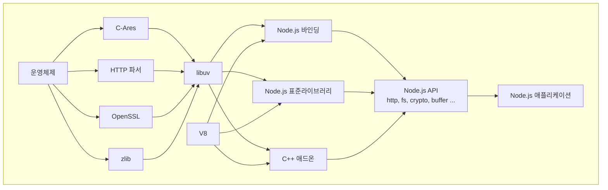

# 2.2 Node.js는 서버에서 어떻게 자바스크립트를 실행

# Node.js의 구성요소

```mermaid
flowchart TB
    subgraph L1[ ]
        APP[Node.js 애플리케이션]
        API[Node.js API<br/>http, fs, crypto, buffer ...]
        BIND[Node.js 바인딩]
        STD[Node.js 표준라이브러리]
        ADDON[C++ 애드온]
        V8[V8]
        UV[libuv]
        CARES[C-Ares]
        HTTPP[HTTP 파서]
        OPENSSL[OpenSSL]
        ZLIB[zlib]
        OS[운영체제]
    end

    OS --> CARES
    OS --> HTTPP
    OS --> OPENSSL
    OS --> ZLIB

    CARES --> UV
    HTTPP --> UV
    OPENSSL --> UV
    ZLIB --> UV

    UV --> BIND
    UV --> STD
    UV --> ADDON

    V8 --> BIND
    V8 --> STD
    V8 --> ADDON

    BIND --> API
    STD --> API
    ADDON --> API

    API --> APP
```
