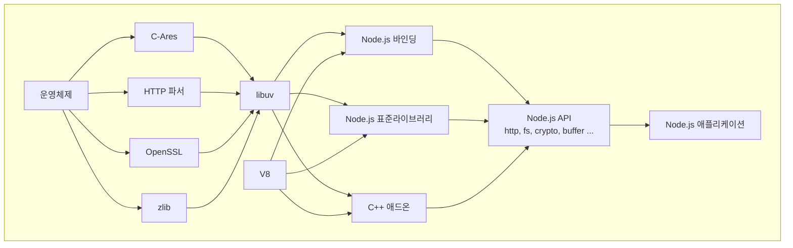

# 2.2 Node.js는 서버에서 어떻게 자바스크립트를 실행

Node.js는 V8 자바스크립트 엔진, libuv에 의존성을 가진 자바스크립트 런타임이다.
런타임은 자바스크립트로 된 프로그램을 실행할 수 있는 프로그램이다.
예를 들어 자바 코드는 자바 실행 환경인 JRE(Java Runtime Environment)에서 실행된다.

브라우저 에서상에서만 작동하던 자바스크립트가 서버에서도 작동할 수 있게 되었는 지 구성요소와 구조를 보기로 한다.

### 2.2.1 Node.js의 구성요소

Node.js의 소스 코드는 C++, 자바스크립트, 파이썬 등으로 이루어져있다.
Node.js는 각 계층이 각 하단에 있는 API를 사용하는 계층의 집합으로 설계되어 있다.

1. 사용자 코드(자바스크립트 )
2. Node.js API 사용, Node.js API는 C++ 바인딩 되어 있는 소스 혹은
3. C++ 애드온을 호출
4. C++에서 V8을 사용해 자바스크립트를 해석(JIT 컴파일러)및 최적화, C/C++ 종속성 코드를 실행, DNS, HTTP를 파서 OpenSSL, zlib 이외의 C/C++코드는
5. libuv의 API를 사용해 운영체제에 맞는 API를 사용한다

Node.js 구성요소중 V8, libuv가 중요하다.
V8은 자바스크립트 코드를 실행하도록 하고, libuv는 이벤트 루프 및 운영체제 계층 기능을 사용하도록 API를 제공한다.

node.js 구성요소
| 구성요소| 설명|
|----|----|
| Node.jsAPI(자바스크립트) | 자바스크립트 API |
| Node.js 바인딩 | 자바스크립트에서 C/C++함수를 호출할 수 있게 한다. |
| Node.js 표준 라이브러리 (C++) | 운영체제와 관련된 함수들, 타이머(setTimeout), 파일시스템(filesystem), 네트워크 요청(HTTP)|
| C/C++ 애드온 | Node.js에서 C/C++ 소스를 실행할 수 있게 하는 애드온 |
| **V8(C++)** | 오픈 소스 자바스크립트 엔진, 자바스크립트를 파싱, 인터프리터, 컴파일, 최적화에 사용 |
| **libuv(C++)** | 비동기 I/O에 초점을 맞춘 멀티플랫폼을 지원하는 라이브러리. 이벤트 루프, 스레드 폴 등을 사용한다. |

---

### 2.2.2 자바스크립트 실행을 위한 V8 엔진
